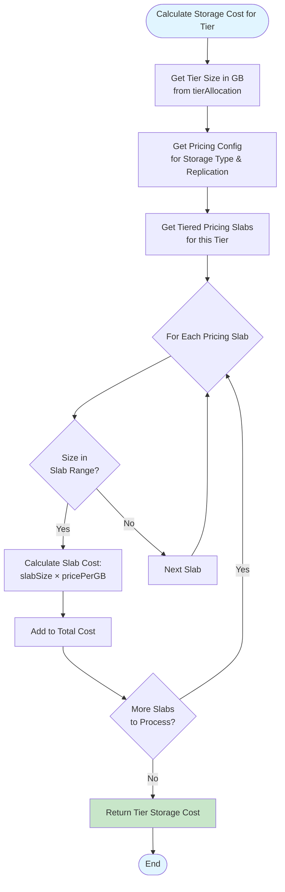

# Storage Cost Calculation Flowchart

## Overview Flowchart

This flowchart explains how costs are calculated for all 5 storage options when all inputs are filled.

```mermaid
flowchart TD
    Start([Start: User Inputs]) --> Inputs[Input Parameters:<br/>- totalSizeGB<br/>- tierAllocation: hot, cold, archive<br/>- numberOfDatabases<br/>- Transaction Inputs<br/>- AWS Transaction Inputs]
    
    Inputs --> LoopStart{For Each of 5 Storage Options}
    
    LoopStart --> Option1[Option 1:<br/>Azure Data Lake Storage LRS]
    LoopStart --> Option2[Option 2:<br/>Azure Data Lake Storage GRS]
    LoopStart --> Option3[Option 3:<br/>Azure Blob Storage LRS]
    LoopStart --> Option4[Option 4:<br/>Azure Blob Storage GRS]
    LoopStart --> Option5[Option 5:<br/>AWS S3]
    
    Option1 --> TierLoop1{For Each Tier:<br/>Hot, Cold, Archive}
    Option2 --> TierLoop2{For Each Tier:<br/>Hot, Cold, Archive}
    Option3 --> TierLoop3{For Each Tier:<br/>Hot, Cold, Archive}
    Option4 --> TierLoop4{For Each Tier:<br/>Hot, Cold, Archive}
    Option5 --> TierLoop5{For Each Tier:<br/>Hot, Cold, Archive}
    
    %% Storage Calculation - Option 1
    TierLoop1 --> CalcSlabCost1["Calculate Tier Storage Cost:<br/>Formula: Σ(slabSize × pricePerGB)<br/>For each pricing slab:<br/>slabSize = min(remainingGB, slabMax - slabMin)<br/>cost = slabSize × pricePerGB"]
    CalcSlabCost1 --> TierLoop1
    CalcSlabCost1 --> IndexCalc1{Is Data Lake<br/>& Hot/Cold?}
    IndexCalc1 -->|Yes| CalcIndex1["Calculate Index Cost:<br/>Formula: sizeGB × indexPrice<br/>Hot: hotSizeGB × indexPrice<br/>Cold: coldSizeGB × indexPrice"]
    IndexCalc1 -->|No| SumTier1["Sum Tier Costs:<br/>Formula: Hot + Cold + Archive + Index<br/>totalTierCost = hotCost + coldCost + archiveCost + indexCost"]
    CalcIndex1 --> SumTier1
    SumTier1 --> MultDB1["Multiply by numberOfDatabases:<br/>Formula: totalTierCost × numberOfDatabases<br/>baseStorageCost = totalTierCost × numberOfDatabases"]
    MultDB1 --> BaseCost1[Base Storage Cost per Month]
    
    %% Storage Calculation - Options 2-5 (simplified)
    TierLoop2 --> CalcSlabCost2["Calculate Tier Storage Cost:<br/>Formula: Σ(slabSize × pricePerGB)"]
    CalcSlabCost2 --> TierLoop2
    CalcSlabCost2 --> IndexCalc2{Is Data Lake<br/>& Hot/Cold?}
    IndexCalc2 -->|Yes| CalcIndex2["Calculate Index Cost:<br/>Formula: sizeGB × indexPrice"]
    IndexCalc2 -->|No| SumTier2["Sum Tier Costs:<br/>Formula: Hot + Cold + Archive + Index"]
    CalcIndex2 --> SumTier2
    SumTier2 --> MultDB2["Multiply by numberOfDatabases:<br/>Formula: totalTierCost × numberOfDatabases"]
    MultDB2 --> BaseCost2[Base Storage Cost per Month]
    
    TierLoop3 --> CalcSlabCost3["Calculate Tier Storage Cost:<br/>Formula: Σ(slabSize × pricePerGB)"]
    CalcSlabCost3 --> TierLoop3
    CalcSlabCost3 --> SumTier3["Sum Tier Costs:<br/>Formula: Hot + Cold + Archive<br/>totalTierCost = hotCost + coldCost + archiveCost"]
    SumTier3 --> MultDB3["Multiply by numberOfDatabases:<br/>Formula: totalTierCost × numberOfDatabases"]
    MultDB3 --> BaseCost3[Base Storage Cost per Month]
    
    TierLoop4 --> CalcSlabCost4["Calculate Tier Storage Cost:<br/>Formula: Σ(slabSize × pricePerGB)"]
    CalcSlabCost4 --> TierLoop4
    CalcSlabCost4 --> SumTier4["Sum Tier Costs:<br/>Formula: Hot + Cold + Archive<br/>totalTierCost = hotCost + coldCost + archiveCost"]
    SumTier4 --> MultDB4["Multiply by numberOfDatabases:<br/>Formula: totalTierCost × numberOfDatabases"]
    MultDB4 --> BaseCost4[Base Storage Cost per Month]
    
    TierLoop5 --> CalcSlabCost5["Calculate Tier Storage Cost:<br/>Formula: Σ(slabSize × pricePerGB)"]
    CalcSlabCost5 --> TierLoop5
    CalcSlabCost5 --> SumTier5["Sum Tier Costs:<br/>Formula: Hot + Cold + Archive<br/>totalTierCost = hotCost + coldCost + archiveCost"]
    SumTier5 --> MultDB5["Multiply by numberOfDatabases:<br/>Formula: totalTierCost × numberOfDatabases"]
    MultDB5 --> BaseCost5[Base Storage Cost per Month]
    
    BaseCost1 --> IncTierLoop1{For Each Tier:<br/>Hot, Cold, Archive}
    BaseCost2 --> IncTierLoop2{For Each Tier:<br/>Hot, Cold, Archive}
    BaseCost3 --> IncTierLoop3{For Each Tier:<br/>Hot, Cold, Archive}
    BaseCost4 --> IncTierLoop4{For Each Tier:<br/>Hot, Cold, Archive}
    BaseCost5 --> IncTierLoop5{For Each Tier:<br/>Hot, Cold, Archive}
    
    %% Azure Incremental Costs - Option 1
    IncTierLoop1 --> CalcWrite1["Write Cost:<br/>Formula: (writeOperations / 10,000) × pricing.writeOperations<br/>writeCost = (writeOps / 10000) × writePrice"]
    CalcWrite1 --> CalcRead1["Read Cost:<br/>Formula: (readOperations / 10,000) × pricing.readOperations<br/>readCost = (readOps / 10000) × readPrice"]
    CalcRead1 --> CalcIterRead1["Iter Read Cost:<br/>Formula: (iterativeReadOps / 10,000) × pricing.iterativeReadOperations<br/>iterReadCost = (iterReadOps / 10000) × iterReadPrice"]
    CalcIterRead1 --> CalcIterWrite1["Iter Write Cost:<br/>Formula: (iterativeWriteOps / 100) × pricing.iterativeWriteOperations<br/>iterWriteCost = (iterWriteOps / 100) × iterWritePrice"]
    CalcIterWrite1 --> CalcOther1["Other Cost:<br/>Formula: (otherOperations / 10,000) × pricing.otherOperations<br/>otherCost = (otherOps / 10000) × otherPrice"]
    CalcOther1 --> CalcArchiveRead1["Archive High Priority Read:<br/>Formula: (archiveHighPriorityRead / 10,000) × pricing.archiveHighPriorityRead<br/>archiveReadCost = (archiveRead / 10000) × archiveReadPrice"]
    CalcArchiveRead1 --> SumTrans1["Sum Transactions:<br/>Formula: Write + Read + IterRead + IterWrite + Other + ArchiveRead<br/>totalTrans = writeCost + readCost + iterReadCost + iterWriteCost + otherCost + archiveReadCost"]
    SumTrans1 --> CalcColdRet1["Cold Retrieval:<br/>Formula: monthlyReadGB × pricing.dataRetrieval<br/>coldRetCost = monthlyReadGB × dataRetrievalPrice"]
    CalcColdRet1 --> CalcArchiveRet1["Archive Retrieval:<br/>Formula: archiveHighPriorityRetrievalGB × pricing.archiveHighPriorityRetrieval<br/>OR: archiveRetrievalGB × pricing.dataRetrieval<br/>archiveRetCost = archiveRetrievalGB × retrievalPrice"]
    CalcArchiveRet1 --> SumRetrieval1["Sum Retrieval Costs:<br/>Formula: Cold Retrieval + Archive Retrieval<br/>totalRetrieval = coldRetCost + archiveRetCost"]
    SumRetrieval1 --> CalcScanned1["Query Scanned Cost:<br/>Formula: queryAccelerationScannedGB × pricing.queryAccelerationScanned<br/>scannedCost = scannedGB × scannedPrice"]
    CalcScanned1 --> CalcReturned1["Query Returned Cost:<br/>Formula: queryAccelerationReturnedGB × pricing.queryAccelerationReturned<br/>returnedCost = returnedGB × returnedPrice"]
    CalcReturned1 --> SumQuery1["Sum Query Acceleration:<br/>Formula: Scanned + Returned<br/>totalQuery = scannedCost + returnedCost"]
    SumQuery1 --> TierTotal1["Tier Total:<br/>Formula: Trans + Retrieval + Query<br/>tierTotal = totalTrans + totalRetrieval + totalQuery"]
    TierTotal1 --> IncTierLoop1
    TierTotal1 --> SumAllTiers1["Sum All Tiers:<br/>Formula: Hot Total + Cold Total + Archive Total<br/>allTiersTotal = hotTotal + coldTotal + archiveTotal"]
    SumAllTiers1 --> MultDBInc1["Multiply by numberOfDatabases:<br/>Formula: allTiersTotal × numberOfDatabases<br/>incrementalCost = allTiersTotal × numberOfDatabases"]
    MultDBInc1 --> IncCalc1[Total Incremental Cost]
    
    %% Azure Incremental Costs - Options 2-4
    IncTierLoop2 --> CalcWrite2["Write Cost:<br/>Formula: (writeOps / 10,000) × price"]
    CalcWrite2 --> CalcRead2["Read Cost:<br/>Formula: (readOps / 10,000) × price"]
    CalcRead2 --> CalcIterRead2["Iter Read Cost:<br/>Formula: (iterReadOps / 10,000) × price"]
    CalcIterRead2 --> CalcIterWrite2["Iter Write Cost:<br/>Formula: (iterWriteOps / 100) × price"]
    CalcIterWrite2 --> CalcOther2["Other Cost:<br/>Formula: (otherOps / 10,000) × price"]
    CalcOther2 --> CalcArchiveRead2["Archive High Priority Read:<br/>Formula: (archiveRead / 10,000) × price"]
    CalcArchiveRead2 --> SumTrans2["Sum Transactions:<br/>Formula: Write + Read + IterRead + IterWrite + Other + ArchiveRead"]
    SumTrans2 --> CalcColdRet2["Cold Retrieval:<br/>Formula: monthlyReadGB × price"]
    CalcColdRet2 --> CalcArchiveRet2["Archive Retrieval:<br/>Formula: archiveRetrievalGB × price"]
    CalcArchiveRet2 --> SumRetrieval2["Sum Retrieval:<br/>Formula: Cold + Archive"]
    SumRetrieval2 --> CalcScanned2["Query Scanned Cost:<br/>Formula: scannedGB × price"]
    CalcScanned2 --> CalcReturned2["Query Returned Cost:<br/>Formula: returnedGB × price"]
    CalcReturned2 --> SumQuery2["Sum Query Acceleration:<br/>Formula: Scanned + Returned"]
    SumQuery2 --> TierTotal2["Tier Total:<br/>Formula: Trans + Retrieval + Query"]
    TierTotal2 --> IncTierLoop2
    TierTotal2 --> SumAllTiers2["Sum All Tiers:<br/>Formula: Hot + Cold + Archive"]
    SumAllTiers2 --> MultDBInc2["Multiply by numberOfDatabases:<br/>Formula: allTiersTotal × numberOfDatabases"]
    MultDBInc2 --> IncCalc2[Total Incremental Cost]
    
    IncTierLoop3 --> CalcWrite3["Write Cost:<br/>Formula: (writeOps / 10,000) × price"]
    CalcWrite3 --> CalcRead3["Read Cost:<br/>Formula: (readOps / 10,000) × price"]
    CalcRead3 --> CalcIterRead3["Iter Read Cost:<br/>Formula: (iterReadOps / 10,000) × price"]
    CalcIterRead3 --> CalcIterWrite3["Iter Write Cost:<br/>Formula: (iterWriteOps / 100) × price"]
    CalcIterWrite3 --> CalcOther3["Other Cost:<br/>Formula: (otherOps / 10,000) × price"]
    CalcOther3 --> CalcArchiveRead3["Archive High Priority Read:<br/>Formula: (archiveRead / 10,000) × price"]
    CalcArchiveRead3 --> SumTrans3["Sum Transactions:<br/>Formula: Write + Read + IterRead + IterWrite + Other + ArchiveRead"]
    SumTrans3 --> CalcColdRet3["Cold Retrieval:<br/>Formula: monthlyReadGB × price"]
    CalcColdRet3 --> CalcArchiveRet3["Archive Retrieval:<br/>Formula: archiveRetrievalGB × price"]
    CalcArchiveRet3 --> SumRetrieval3["Sum Retrieval:<br/>Formula: Cold + Archive"]
    SumRetrieval3 --> CalcScanned3["Query Scanned Cost:<br/>Formula: scannedGB × price"]
    CalcScanned3 --> CalcReturned3["Query Returned Cost:<br/>Formula: returnedGB × price"]
    CalcReturned3 --> SumQuery3["Sum Query Acceleration:<br/>Formula: Scanned + Returned"]
    SumQuery3 --> TierTotal3["Tier Total:<br/>Formula: Trans + Retrieval + Query"]
    TierTotal3 --> IncTierLoop3
    TierTotal3 --> SumAllTiers3["Sum All Tiers:<br/>Formula: Hot + Cold + Archive"]
    SumAllTiers3 --> MultDBInc3["Multiply by numberOfDatabases:<br/>Formula: allTiersTotal × numberOfDatabases"]
    MultDBInc3 --> IncCalc3[Total Incremental Cost]
    
    IncTierLoop4 --> CalcWrite4["Write Cost:<br/>Formula: (writeOps / 10,000) × price"]
    CalcWrite4 --> CalcRead4["Read Cost:<br/>Formula: (readOps / 10,000) × price"]
    CalcRead4 --> CalcIterRead4["Iter Read Cost:<br/>Formula: (iterReadOps / 10,000) × price"]
    CalcIterRead4 --> CalcIterWrite4["Iter Write Cost:<br/>Formula: (iterWriteOps / 100) × price"]
    CalcIterWrite4 --> CalcOther4["Other Cost:<br/>Formula: (otherOps / 10,000) × price"]
    CalcOther4 --> CalcArchiveRead4["Archive High Priority Read:<br/>Formula: (archiveRead / 10,000) × price"]
    CalcArchiveRead4 --> SumTrans4["Sum Transactions:<br/>Formula: Write + Read + IterRead + IterWrite + Other + ArchiveRead"]
    SumTrans4 --> CalcColdRet4["Cold Retrieval:<br/>Formula: monthlyReadGB × price"]
    CalcColdRet4 --> CalcArchiveRet4["Archive Retrieval:<br/>Formula: archiveRetrievalGB × price"]
    CalcArchiveRet4 --> SumRetrieval4["Sum Retrieval:<br/>Formula: Cold + Archive"]
    SumRetrieval4 --> CalcScanned4["Query Scanned Cost:<br/>Formula: scannedGB × price"]
    CalcScanned4 --> CalcReturned4["Query Returned Cost:<br/>Formula: returnedGB × price"]
    CalcReturned4 --> SumQuery4["Sum Query Acceleration:<br/>Formula: Scanned + Returned"]
    SumQuery4 --> TierTotal4["Tier Total:<br/>Formula: Trans + Retrieval + Query"]
    TierTotal4 --> IncTierLoop4
    TierTotal4 --> SumAllTiers4["Sum All Tiers:<br/>Formula: Hot + Cold + Archive"]
    SumAllTiers4 --> MultDBInc4["Multiply by numberOfDatabases:<br/>Formula: allTiersTotal × numberOfDatabases"]
    MultDBInc4 --> IncCalc4[Total Incremental Cost]
    
    %% AWS Incremental Costs - Option 5
    IncTierLoop5 --> CalcPut5["PUT/COPY/POST/LIST Cost:<br/>Formula: (putCopyPostListRequests / 1,000) × tierPricing.putCopyPostListRequests<br/>putCost = (putRequests / 1000) × putPrice"]
    CalcPut5 --> CalcGet5["GET/SELECT Cost:<br/>Formula: (getSelectRequests / 1,000) × tierPricing.getSelectRequests<br/>getCost = (getRequests / 1000) × getPrice"]
    CalcGet5 --> SumRequests5["Sum Requests:<br/>Formula: PUT + GET<br/>totalRequests = putCost + getCost"]
    SumRequests5 --> CalcColdRet5["Cold Retrieval:<br/>Formula: dataRetrievalGB × tierPricing.dataRetrieval.standard<br/>coldRetCost = dataRetrievalGB × standardPrice"]
    CalcColdRet5 --> CalcExpeditedRet5["Expedited Retrieval:<br/>Formula: (dataRetrievalGB × expeditedPrice) +<br/>(dataRetrievalRequests / 1,000 × expeditedReqPrice)<br/>expeditedCost = (dataRetrievalGB × expeditedPrice) +<br/>(dataRetrievalRequests / 1000 × expeditedReqPrice)"]
    CalcExpeditedRet5 --> CalcStandardRet5["Standard Retrieval:<br/>Formula: (dataRetrievalGB × standardPrice) +<br/>(dataRetrievalRequests / 1,000 × standardReqPrice)<br/>standardCost = (dataRetrievalGB × standardPrice) +<br/>(dataRetrievalRequests / 1000 × standardReqPrice)"]
    CalcStandardRet5 --> SumRetrieval5["Sum Retrieval Costs:<br/>Formula: Cold + Expedited OR Standard<br/>totalRetrieval = coldRetCost + expeditedCost OR standardCost"]
    SumRetrieval5 --> CalcEarlyDel5["Early Deletion:<br/>Formula: sizeGB × earlyDeletionPenalty ×<br/>(remainingDays / minimumStorageDurationDays)<br/>remainingDays = minDays - storageDays<br/>earlyDelCost = sizeGB × penalty × (remainingDays / minDays)"]
    CalcEarlyDel5 --> SumEarlyDel5["Sum Early Deletion:<br/>Formula: Early Deletion Cost<br/>totalEarlyDeletion = earlyDelCost"]
    SumEarlyDel5 --> TierTotal5["Tier Total:<br/>Formula: Requests + Retrieval + Early Deletion<br/>tierTotal = totalRequests + totalRetrieval + totalEarlyDeletion"]
    TierTotal5 --> IncTierLoop5
    TierTotal5 --> SumAllTiers5["Sum All Tiers:<br/>Formula: Hot Total + Cold Total + Archive Total<br/>allTiersTotal = hotTotal + coldTotal + archiveTotal"]
    SumAllTiers5 --> MultDBInc5["Multiply by numberOfDatabases:<br/>Formula: allTiersTotal × numberOfDatabases<br/>incrementalCost = allTiersTotal × numberOfDatabases"]
    MultDBInc5 --> IncCalc5[Total Incremental Cost]
    
    IncCalc1 --> CalcFinal1["Final Cost:<br/>Formula: Base Storage Cost + Total Incremental Cost<br/>finalCost = baseStorageCost + incrementalCost"]
    IncCalc2 --> CalcFinal2["Final Cost:<br/>Formula: Base Storage Cost + Total Incremental Cost<br/>finalCost = baseStorageCost + incrementalCost"]
    IncCalc3 --> CalcFinal3["Final Cost:<br/>Formula: Base Storage Cost + Total Incremental Cost<br/>finalCost = baseStorageCost + incrementalCost"]
    IncCalc4 --> CalcFinal4["Final Cost:<br/>Formula: Base Storage Cost + Total Incremental Cost<br/>finalCost = baseStorageCost + incrementalCost"]
    IncCalc5 --> CalcFinal5["Final Cost:<br/>Formula: Base Storage Cost + Total Incremental Cost<br/>finalCost = baseStorageCost + incrementalCost"]
    
    CalcFinal1 --> Results[Display Results:<br/>5 Storage Options<br/>with Monthly Costs]
    CalcFinal2 --> Results
    CalcFinal3 --> Results
    CalcFinal4 --> Results
    CalcFinal5 --> Results
    
    Results --> End([End])
    
    style Start fill:#e1f5ff
    style End fill:#e1f5ff
    style Results fill:#c8e6c9
    style BaseCost1 fill:#e8f5e9
    style BaseCost2 fill:#e8f5e9
    style BaseCost3 fill:#e8f5e9
    style BaseCost4 fill:#e8f5e9
    style BaseCost5 fill:#e8f5e9
    style CalcFinal1 fill:#c8e6c9
    style CalcFinal2 fill:#c8e6c9
    style CalcFinal3 fill:#c8e6c9
    style CalcFinal4 fill:#c8e6c9
    style CalcFinal5 fill:#c8e6c9
    style IncCalc1 fill:#fff9c4
    style IncCalc2 fill:#fff9c4
    style IncCalc3 fill:#fff9c4
    style IncCalc4 fill:#fff9c4
    style IncCalc5 fill:#fff9c4
    style CalcSlabCost1 fill:#e3f2fd
    style CalcSlabCost2 fill:#e3f2fd
    style CalcSlabCost3 fill:#e3f2fd
    style CalcSlabCost4 fill:#e3f2fd
    style CalcSlabCost5 fill:#e3f2fd
    style CalcWrite1 fill:#fff3e0
    style CalcRead1 fill:#fff3e0
    style CalcIterRead1 fill:#fff3e0
    style CalcIterWrite1 fill:#fff3e0
    style CalcOther1 fill:#fff3e0
    style CalcArchiveRead1 fill:#fff3e0
    style CalcColdRet1 fill:#f3e5f5
    style CalcArchiveRet1 fill:#f3e5f5
    style CalcScanned1 fill:#e8f5e9
    style CalcReturned1 fill:#e8f5e9
    style CalcPut5 fill:#fff3e0
    style CalcGet5 fill:#fff3e0
    style CalcEarlyDel5 fill:#fce4ec
```

## Detailed Storage Cost Calculation



## Detailed Incremental Cost Calculation (Azure) - All Parameters

```mermaid
flowchart TD
    Start([Calculate Incremental Costs - Azure<br/>All Parameters Filled]) --> TierLoop{For Each Tier:<br/>Hot, Cold, Archive}
    
    TierLoop --> TransCalc[Calculate Transaction Costs]
    
    TransCalc --> CheckWrite{writeOperations<br/>> 0?}
    CheckWrite -->|Yes| CalcWrite[Write Operations Cost:<br/>writeOperations / 10,000 ×<br/>pricing.writeOperations]
    CheckWrite -->|No| WriteCost0[Write Cost = 0]
    
    CalcWrite --> CheckRead{readOperations<br/>> 0?}
    WriteCost0 --> CheckRead
    
    CheckRead -->|Yes| CalcRead[Read Operations Cost:<br/>readOperations / 10,000 ×<br/>pricing.readOperations]
    CheckRead -->|No| ReadCost0[Read Cost = 0]
    
    CalcRead --> CheckIterRead{iterativeReadOperations<br/>exists?}
    ReadCost0 --> CheckIterRead
    
    CheckIterRead -->|Yes| CalcIterRead[Iterative Read Cost:<br/>iterativeReadOperations / 10,000 ×<br/>pricing.iterativeReadOperations]
    CheckIterRead -->|No| IterReadCost0[Iterative Read Cost = 0]
    
    CalcIterRead --> CheckIterWrite{iterativeWriteOperations<br/>exists?}
    IterReadCost0 --> CheckIterWrite
    
    CheckIterWrite -->|Yes| CalcIterWrite[Iterative Write Cost:<br/>iterativeWriteOperations / 100 ×<br/>pricing.iterativeWriteOperations]
    CheckIterWrite -->|No| IterWriteCost0[Iterative Write Cost = 0]
    
    CalcIterWrite --> CheckOther{otherOperations<br/>exists?}
    IterWriteCost0 --> CheckOther
    
    CheckOther -->|Yes| CalcOther[Other Operations Cost:<br/>otherOperations / 10,000 ×<br/>pricing.otherOperations]
    CheckOther -->|No| OtherCost0[Other Cost = 0]
    
    CalcOther --> CheckArchiveRead{Is Archive Tier &<br/>archiveHighPriorityRead<br/>exists?}
    OtherCost0 --> CheckArchiveRead
    
    CheckArchiveRead -->|Yes| CalcArchiveRead[Archive High Priority Read:<br/>archiveHighPriorityRead / 10,000 ×<br/>pricing.archiveHighPriorityRead]
    CheckArchiveRead -->|No| ArchiveReadCost0[Archive Read Cost = 0]
    
    CalcArchiveRead --> SumTrans[Sum All Transaction Costs:<br/>Write + Read + IterRead +<br/>IterWrite + Other + ArchiveRead]
    ArchiveReadCost0 --> SumTrans
    
    SumTrans --> RetrievalCalc[Calculate Retrieval Costs]
    
    RetrievalCalc --> RetrievalCheck{Is Cold or<br/>Archive Tier?}
    
    RetrievalCheck -->|No| NoRetrieval[Retrieval Cost = 0]
    RetrievalCheck -->|Yes| TierCheck{Tier Type?}
    
    TierCheck -->|Cold| ColdRetrievalGB[Get monthlyReadGB]
    TierCheck -->|Archive| ArchiveRetrievalGB[Get archiveHighPriorityRetrievalGB]
    
    ColdRetrievalGB --> CheckColdGB{monthlyReadGB<br/>> 0?}
    ArchiveRetrievalGB --> CheckArchiveGB{archiveHighPriorityRetrievalGB<br/>> 0?}
    
    CheckColdGB -->|Yes| CalcColdRet[Cold Retrieval Cost:<br/>monthlyReadGB ×<br/>pricing.dataRetrieval]
    CheckColdGB -->|No| NoRetrieval
    
    CheckArchiveGB -->|Yes| CheckHighPriority{Has High Priority<br/>Retrieval Pricing?}
    CheckArchiveGB -->|No| NoRetrieval
    
    CheckHighPriority -->|Yes| CalcHighPriorityRet[High Priority Retrieval:<br/>archiveHighPriorityRetrievalGB ×<br/>pricing.archiveHighPriorityRetrieval]
    CheckHighPriority -->|No| CalcStandardRet[Standard Archive Retrieval:<br/>archiveHighPriorityRetrievalGB ×<br/>pricing.dataRetrieval]
    
    CalcColdRet --> SumRetrieval[Sum Retrieval Costs]
    CalcHighPriorityRet --> SumRetrieval
    CalcStandardRet --> SumRetrieval
    NoRetrieval --> SumRetrieval
    
    SumRetrieval --> QueryCheck{Is Hot or<br/>Cold Tier?}
    
    QueryCheck -->|No| NoQuery[Query Acceleration = 0]
    QueryCheck -->|Yes| CheckScanned{queryAccelerationScannedGB<br/>exists?}
    
    CheckScanned -->|Yes| CalcScanned[Scanned GB Cost:<br/>queryAccelerationScannedGB ×<br/>pricing.queryAccelerationScanned]
    CheckScanned -->|No| ScannedCost0[Scanned Cost = 0]
    
    CalcScanned --> CheckReturned{queryAccelerationReturnedGB<br/>exists?}
    ScannedCost0 --> CheckReturned
    
    CheckReturned -->|Yes| CalcReturned[Returned GB Cost:<br/>queryAccelerationReturnedGB ×<br/>pricing.queryAccelerationReturned]
    CheckReturned -->|No| ReturnedCost0[Returned Cost = 0]
    
    CalcReturned --> SumQuery[Sum Query Acceleration:<br/>Scanned + Returned]
    ReturnedCost0 --> SumQuery
    NoQuery --> SumQuery
    
    SumQuery --> TierTotal[Total for Tier:<br/>Transactions + Retrieval + Query]
    
    TierTotal --> MoreTiers{More Tiers?}
    MoreTiers -->|Yes| TierLoop
    MoreTiers -->|No| SumAllTiers[Sum All Tier Incremental Costs:<br/>Hot Total + Cold Total + Archive Total]
    
    SumAllTiers --> MultDB[Multiply by<br/>numberOfDatabases]
    
    MultDB --> ReturnInc[Return Incremental Cost Breakdown:<br/>- transactions: totalTransactions × DBs<br/>- retrieval: totalRetrieval × DBs<br/>- queryAcceleration: totalQuery × DBs<br/>- total: all × DBs]
    
    ReturnInc --> End([End])
    
    style Start fill:#e1f5ff
    style End fill:#e1f5ff
    style ReturnInc fill:#c8e6c9
    style CheckWrite fill:#fff9c4
    style CheckRead fill:#fff9c4
    style CheckIterRead fill:#fff9c4
    style CheckIterWrite fill:#fff9c4
    style CheckOther fill:#fff9c4
    style CheckArchiveRead fill:#fff9c4
    style RetrievalCheck fill:#fff9c4
    style QueryCheck fill:#fff9c4
```



## Detailed Incremental Cost Calculation (AWS) - All Parameters

```mermaid
flowchart TD
    Start([Calculate Incremental Costs - AWS<br/>All Parameters Filled]) --> TierLoop{For Each Tier:<br/>Hot, Cold, Archive}
    
    TierLoop --> RequestCalc[Calculate Request Costs]
    
    RequestCalc --> CheckPut{putCopyPostListRequests<br/>exists?}
    
    CheckPut -->|Yes| CalcPut[PUT/COPY/POST/LIST Cost:<br/>putCopyPostListRequests / 1,000 ×<br/>tierPricing.putCopyPostListRequests]
    CheckPut -->|No| PutCost0[PUT Cost = 0]
    
    CalcPut --> CheckGet{getSelectRequests<br/>exists?}
    PutCost0 --> CheckGet
    
    CheckGet -->|Yes| CalcGet[GET/SELECT Cost:<br/>getSelectRequests / 1,000 ×<br/>tierPricing.getSelectRequests]
    CheckGet -->|No| GetCost0[GET Cost = 0]
    
    CalcGet --> SumRequests[Sum Request Costs:<br/>PUT + GET]
    GetCost0 --> SumRequests
    
    SumRequests --> RetrievalCheck{Is Cold or<br/>Archive Tier?}
    
    RetrievalCheck -->|No| NoRetrieval[Retrieval Cost = 0]
    RetrievalCheck -->|Yes| CheckRetrievalGB{dataRetrievalGB<br/>> 0?}
    
    CheckRetrievalGB -->|No| NoRetrieval
    CheckRetrievalGB -->|Yes| TierType{Tier Type?}
    
    TierType -->|Cold| CheckColdRet{Has dataRetrieval<br/>.standard?}
    TierType -->|Archive| CheckArchiveRet{Has dataRetrieval<br/>pricing?}
    
    CheckColdRet -->|Yes| CalcColdRet[Cold Retrieval Cost:<br/>dataRetrievalGB ×<br/>tierPricing.dataRetrieval.standard]
    CheckColdRet -->|No| NoRetrieval
    
    CheckArchiveRet -->|Yes| CheckRetrievalType{retrievalType?}
    CheckArchiveRet -->|No| NoRetrieval
    
    CheckRetrievalType -->|Expedited| ExpeditedPath[Expedited Retrieval]
    CheckRetrievalType -->|Standard| StandardPath[Standard Retrieval]
    
    ExpeditedPath --> CalcExpeditedGB[Expedited GB Cost:<br/>dataRetrievalGB ×<br/>tierPricing.dataRetrieval.expedited]
    
    CalcExpeditedGB --> CheckExpeditedReqs{dataRetrievalRequests<br/>exists &<br/>has expedited pricing?}
    
    CheckExpeditedReqs -->|Yes| CalcExpeditedReqs[Expedited Request Cost:<br/>dataRetrievalRequests / 1,000 ×<br/>tierPricing.dataRetrievalRequests.expedited]
    CheckExpeditedReqs -->|No| ExpeditedReqs0[Request Cost = 0]
    
    CalcExpeditedReqs --> SumExpedited[Sum Expedited:<br/>GB Cost + Request Cost]
    ExpeditedReqs0 --> SumExpedited
    
    StandardPath --> CalcStandardGB[Standard GB Cost:<br/>dataRetrievalGB ×<br/>tierPricing.dataRetrieval.standard]
    
    CalcStandardGB --> CheckStandardReqs{dataRetrievalRequests<br/>exists &<br/>has standard pricing?}
    
    CheckStandardReqs -->|Yes| CalcStandardReqs[Standard Request Cost:<br/>dataRetrievalRequests / 1,000 ×<br/>tierPricing.dataRetrievalRequests.standard]
    CheckStandardReqs -->|No| StandardReqs0[Request Cost = 0]
    
    CalcStandardReqs --> SumStandard[Sum Standard:<br/>GB Cost + Request Cost]
    StandardReqs0 --> SumStandard
    
    CalcColdRet --> SumRetrieval[Sum Retrieval Costs]
    SumExpedited --> SumRetrieval
    SumStandard --> SumRetrieval
    NoRetrieval --> SumRetrieval
    
    SumRetrieval --> EarlyDelCheck{Has minimumStorageDurationDays<br/>pricing?}
    
    EarlyDelCheck -->|No| NoEarlyDel[Early Deletion = 0]
    EarlyDelCheck -->|Yes| CheckStorageDays{storageDurationDays<br/>exists?}
    
    CheckStorageDays -->|No| NoEarlyDel
    CheckStorageDays -->|Yes| CalcRemainingDays[Calculate Remaining Days:<br/>remainingDays = minimumStorageDurationDays -<br/>storageDurationDays]
    
    CalcRemainingDays --> CheckRemaining{remainingDays<br/>> 0?}
    
    CheckRemaining -->|No| NoEarlyDel
    CheckRemaining -->|Yes| CheckEarlyDelPenalty{Has earlyDeletionPenalty<br/>pricing?}
    
    CheckEarlyDelPenalty -->|Yes| CalcEarlyDel[Calculate Early Deletion:<br/>sizeGB × earlyDeletionPenalty ×<br/>remainingDays / minimumStorageDurationDays]
    CheckEarlyDelPenalty -->|No| NoEarlyDel
    
    CalcEarlyDel --> SumEarlyDel[Sum Early Deletion Costs]
    NoEarlyDel --> SumEarlyDel
    
    SumEarlyDel --> TierTotal[Total for Tier:<br/>Requests + Retrieval + Early Deletion]
    
    TierTotal --> MoreTiers{More Tiers?}
    MoreTiers -->|Yes| TierLoop
    MoreTiers -->|No| SumAllTiers[Sum All Tier Incremental Costs:<br/>Hot Total + Cold Total + Archive Total]
    
    SumAllTiers --> MultDB[Multiply by<br/>numberOfDatabases]
    
    MultDB --> ReturnInc[Return Incremental Cost Breakdown:<br/>- transactions/requests: totalRequests × DBs<br/>- retrieval: totalRetrieval × DBs<br/>- earlyDeletion: totalEarlyDeletion × DBs<br/>- total: all × DBs]
    
    ReturnInc --> End([End])
    
    style Start fill:#e1f5ff
    style End fill:#e1f5ff
    style ReturnInc fill:#c8e6c9
    style CheckPut fill:#fff9c4
    style CheckGet fill:#fff9c4
    style RetrievalCheck fill:#fff9c4
    style CheckRetrievalType fill:#fff9c4
    style EarlyDelCheck fill:#fff9c4
    style CheckRemaining fill:#fff9c4
```


